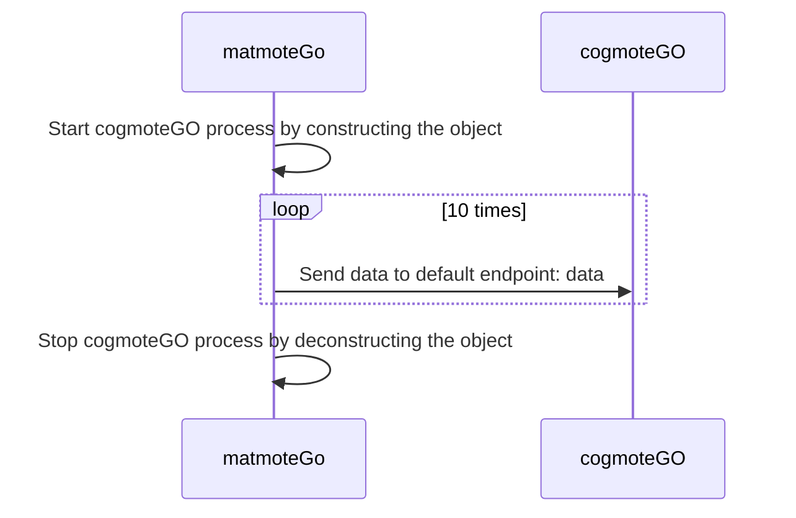
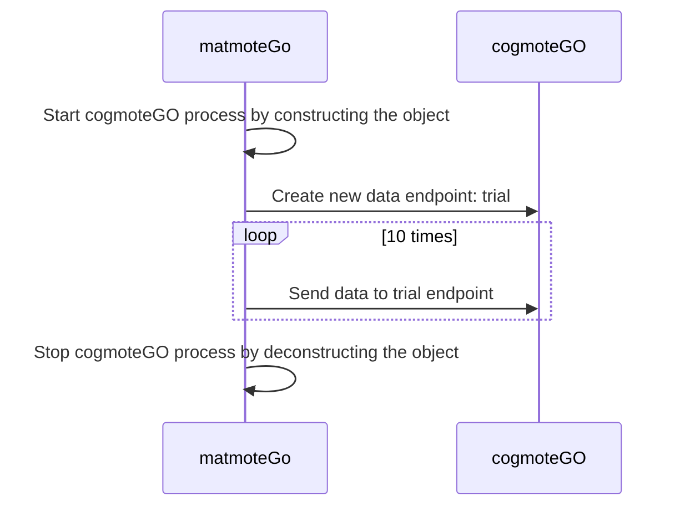
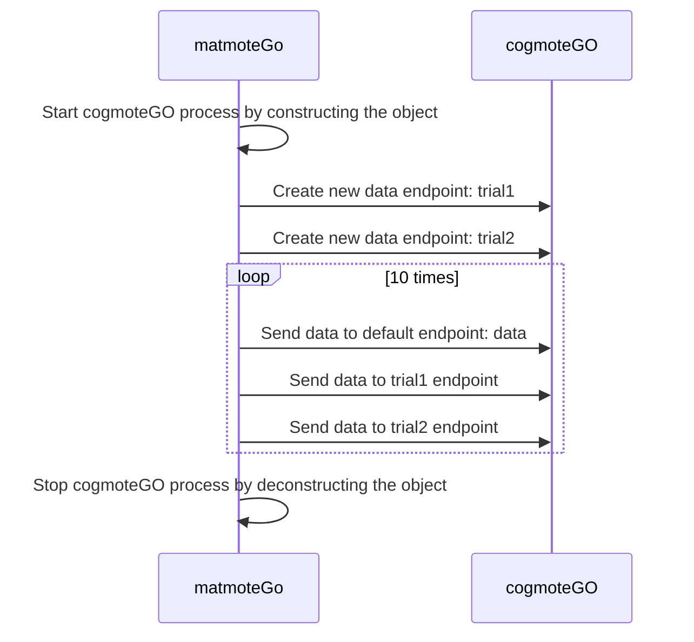

<div>
<h1 align=center><code>matmoteGO</code></h1>
</div>
<br>

## Introduction
`matmoteGO` is a `matlab` api for communication with `cogmoteGO`, which broadcasts data through HTTP protocol

## Install
```sh
git clone --depth 1 https://github.com/Ccccraz/matmoteGO
```

## Usage
### Send data to default endpoint
you can send data to the default endpoint of `cogmoteGO` by `send` method of `MatmoteGo` object

this example shows how to send data to the default endpoint of `cogmoteGO`

> `cogmoteGO` has a default endpoint named `data`

```matlab
% create a MatmoteGo object
remote = MatmoteGo();

% create a fake data structure
data = struct('name', 'Alice', 'age', 30, 'salary', 50000);

% send data to the default endpoint
for i = 1:10
    pause(1);
    remote.send(data); % send data to default endpoint: data
    disp("Wrote " + num2str(i) + " msg to data");
end
```


### Send data to custom endpoint

`matmoteGo` allows you to create custom endpoints and send data to these endpoints. This is done through:
- `createEndpoint`: creates a new endpoint
- `sendTo`: sends data to a specific endpoint

This example shows how to create a custom endpoint and send data to that endpoint

```matlab
remote = MatmoteGo();

% create a custom endpoint
endpoint = "trial";
remote.createEndpoint(endpoint); % create new endpoint: trial

data = struct('name', 'Alice', 'age', 30, 'salary', 50000);

for i = 1:10
    remote.sendTo(data, endpoint); % send data to custom endpoint: trial
    pause(1);
    disp("Wrote " + num2str(i) + " msg to endpoint: " + endpoint);
end
```


### Send data to multiple endpoints at the same time

This example shows how to create multiple custom endpoints and send data to these endpoints and the default endpoint at the same time

```matlab
remote = MatmoteGo();

% create custom endpoint trial1 and trial2
endpoint_1 = "trial1";
endpoint_2 = "trial2";
remote.createEndpoint(endpoint_1);
remote.createEndpoint(endpoint_2);

% prepare data for three different endpoints
data = struct('name', 'abc', 'age', 10, 'salary', 50000);
data_1 = struct('name', 'bca', 'age', 20, 'salary', 50000);
data_2 = struct('name', 'cba', 'age', 30, 'salary', 50000);

for i = 1:10
    pause(1);
    remote.send(data); % send data to default endpoint: data
    remote.sendTo(data_1, endpoint_1); % send data to trial_001 endpoint
    remote.sendTo(data_2, endpoint_2); % send data to trial_002 endpoint
end
```

