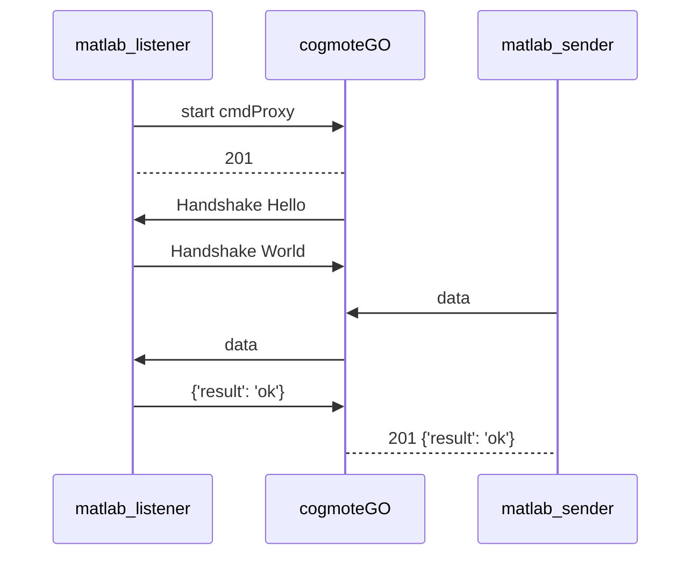
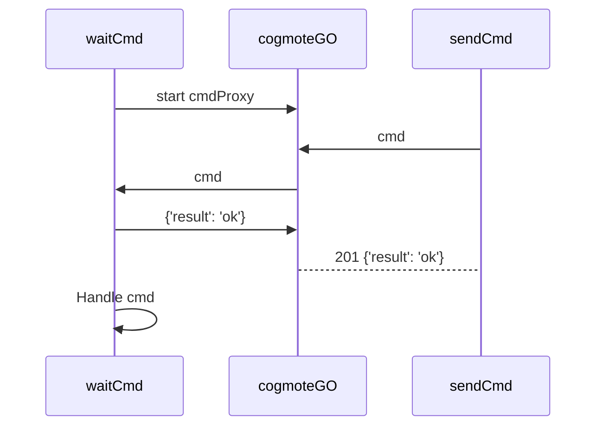
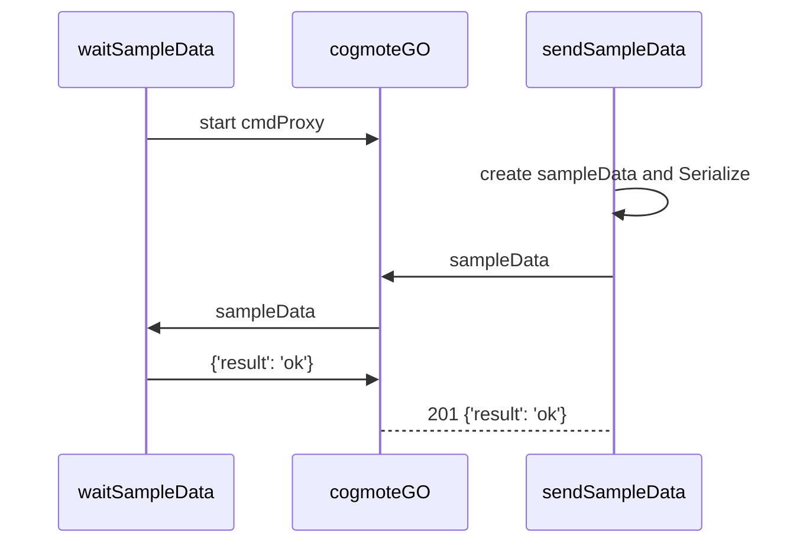
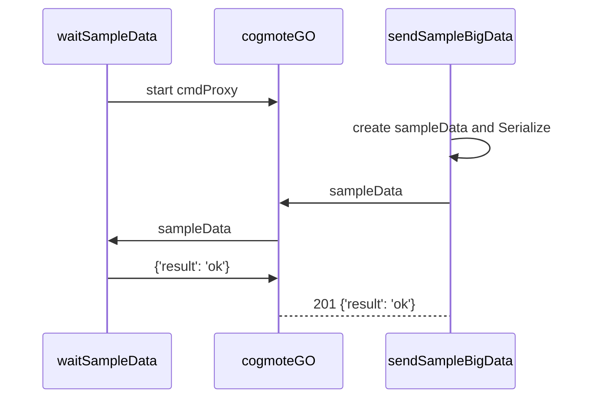

## cmdProxy examples

### Overview

### send cmd
It involves: `sendCmd` and `waitCmd`

### send serialized object
It involves: `sendSampleData`, `waitSampleData`, `sampleData`

### send serialized big object
It involves: `sendSampleBigData`, `waitSampleData`, `sampleBigData`

